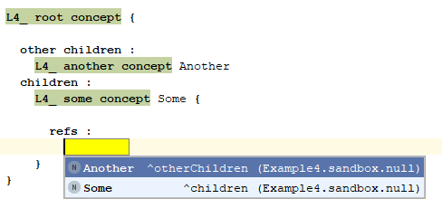

= MPS Smart Reference behavior

This project creates a few languages and sandboxes to demonstrate how smart references work.

It also points out some apparent inconsistencies in the behavior.

== Example 1 - Smart Reference without editor for reference Concept

`Example1` shows that without an editor for the `SomeConceptRef`, the autocomplete functionality shows the option to create an instance of the smart reference (i.e., a `SomeConceptRef` instance). 
It does not, however, show a list of all instances of `SomeConcept`. It does show them in an instance of the `SomeConceptRef` `target` reference.

I.e., the expected Smart Reference behavior is not yet activated in this example.


== Example 2 - Smart Reference with editor for reference Concept

`Example2` shows that when an _unrelated_ editor for `SomeConceptRef` is provided (in addition to `Example1`), that the Smart Reference behavior is enabled.


== Example 3 - Abstract reference without editors for any reference Concept

`Example3` introduces `AnotherConcept`, whose inheritance tree only matches on `BaseConcept` with `SomeConcept`. 
The abstract `BaseRef` and its two derived Concepts, allows the language user to create references to either `AnotherConcept` or `SomeConcept`.

However, as there are no editors defined, it shows no Smart References, only the Concept instances.


== Example 4 - Abstract reference with single editor for one reference Concept

As `Example 3`, but with an editor defined for `AnotherConcept`. This activates the Smart Reference behavior for both the `AnotherConcept`, as well as the `SomeConcept`.



== Example 5 - Smart Reference specialization

Smart Reference specialization should allow a derived class to specialize the reference (i.e., narrow the type of the concept referred to)

[From the manual](https://confluence.jetbrains.com/pages/viewpage.action?pageId=39782069#MPSUser'sGuide(onepage)-Smartreferences):
```
Specialized references and children

Sometimes, when one concept extends another, we not only want to inherit all of its members but also want to override some of its traits. This is possible with children and references specialization. When you specialize a child or reference, you narrow its target type. For example, if you have concept A which extends B, and have a reference r in concept C with target type B, you might narrow the type of reference r in C's subconcepts. It works the same way for concept's children.
```

Unexpectedly, this specification shows errors. When compiled while ignoring these errors, the reflective editor shows multiple instances of the specialized reference. 

